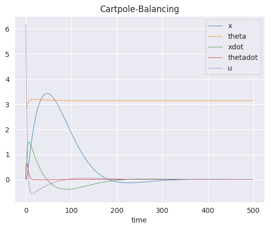
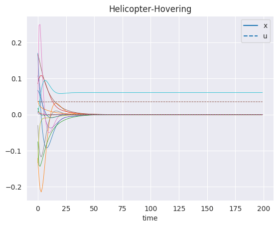
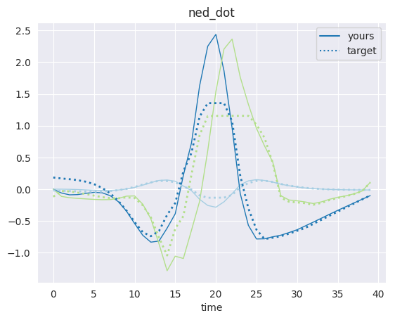
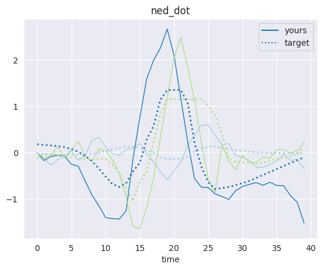

# Implementation of LQR, iLQR, DDP and Feedback Linearization techniques.

## Part 1: Cartpole-Balancing
A non linear cartpole balancing system was provided. The objective was to balance the cartpole at a single point. Hence, the system was linearized about that single point. This linearized system was used to solve for the infinite horizon controller using LQR.

## Part 2: Helicopter Hover
A similar non linear helicopter hovering system was provided. The objective was to stabilize the hovering system. The infinite horizon controller was determined for the linearized system.

## Part 3: Hopper Stabilization
The objective was to stabilize and observe the hopper under different levels of perturbations for a set of points.

   

## Part 4: Trajectory following for a helicopter flight

Given a non-linear system, the objective was to trabsform the system into a LTV setting and run LQR. A reference trajectory was provided, that is approximately feasible. 

## Setup

Refer to **requirements.txt** to install all the necessary dependencies.
To set up Anaconda environment, refer https://www.anaconda.com/
For Mujoco-py installation, refer https://github.com/openai/mujoco-py
